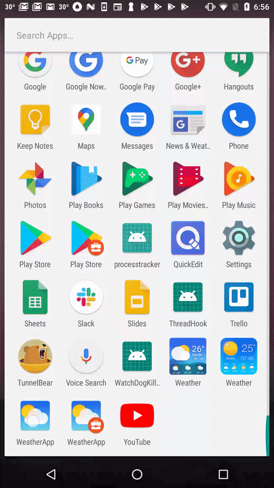

# The solution for currency list

## Demo

## Structure.
There are two modules in this solution: servicelibrary and app.

### servicelibrary
This module handle the api calls and mapping the api response to the data that the app can consume.

### app
This module handle the weather list and recent search.
1. Weather list is in the mainui package and the UI is separated to several classes like BindListener, DbHelper and etc as well as the Activity class and RecyclerViewAdapter class since the UI logic is complex.
1. Recent search package just include the Activity and RecyclerViewAdapter classes.

## Test
There three tests, when running the test, the api response will be printed.
1. WeatherRepositoryTest.testQueryByCityName test searching by city.
1. WeatherRepositoryTest.testQueryByZipCode test searching by zip code.
1. WeatherRepositoryTest.testQueryByGeoLocation test searching by geo location.

UI tests and Db tests can be added later.

